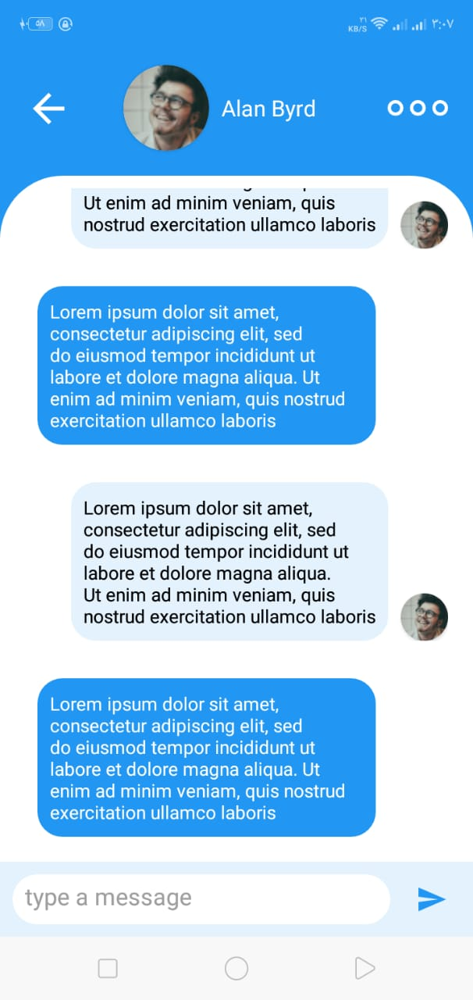

# API_Chat
Retrive chat data from api

# Tools

Java, & Material design

Intuit library for supporting multi-screens

Android Jetpack (DataBinding & Navigation)
 
3rd Party Libraries (Retrofit “REST API” & Picasso)

# YouTube

https://www.youtube.com/watch?v=6r-S4zk0Sy8

# Screenshots

 
